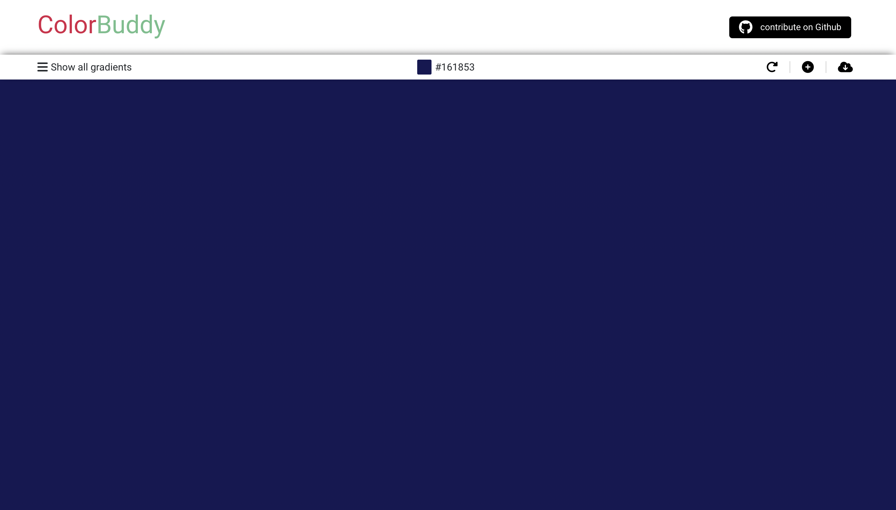

# ColorBuddy

A color Palete app designed for devlopers to easliy choose gradient colors!

 ## Screenshots




## Deployment

To deploy on the local host 

```bash
  npm i 
```
   which will install all the dependencies 

```bash
  npm start 
```
for starting up the server 